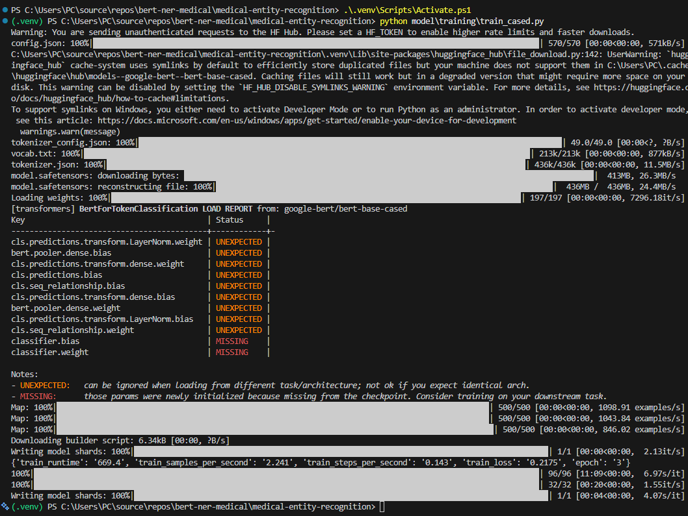
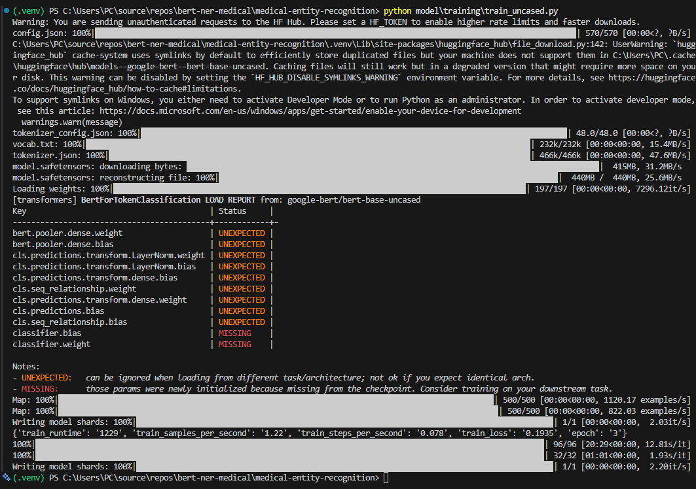
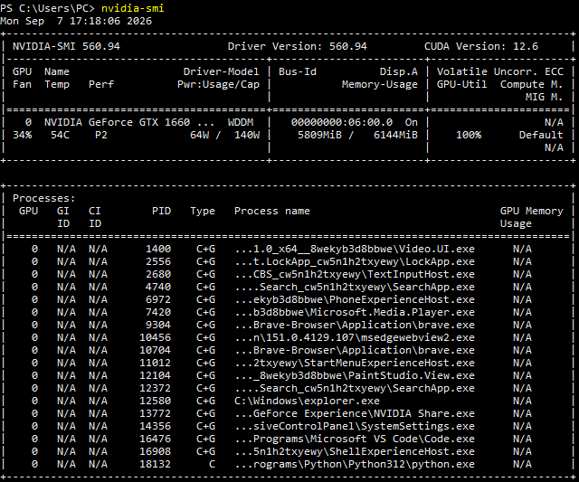
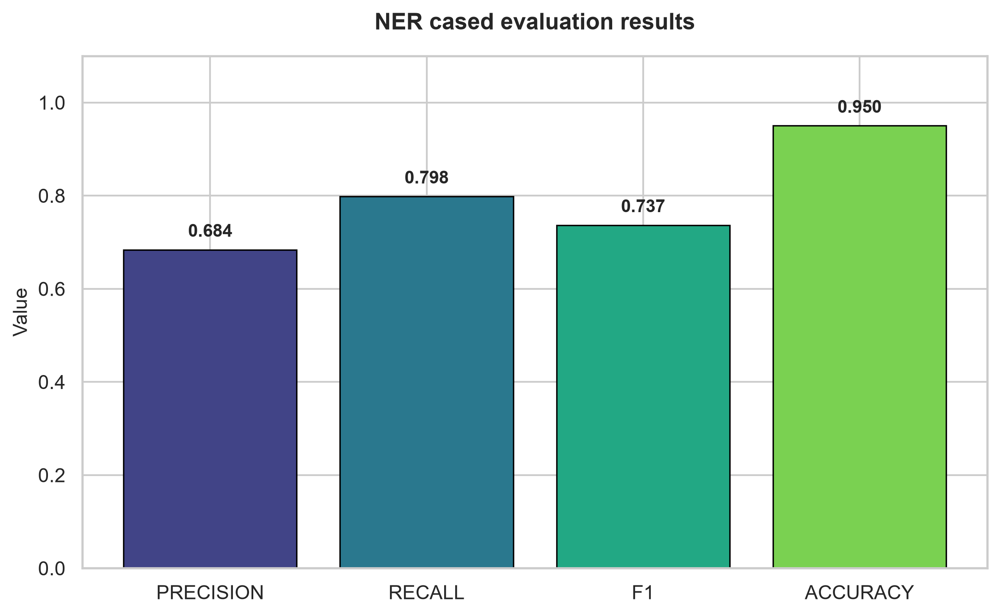
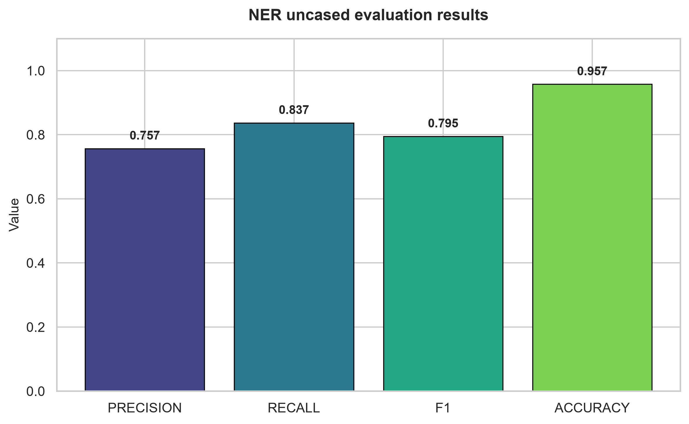

# The project purpose
The purpose of this project is to analyze and evaluate two different BERT models using NER approach on medical entities, where one of them is uncased and the other one is cased.

Cased preserve the letter casing.
Uncased does not do that.

The main goal is to check whether preserving letter casing affects the model's ability to understand the labels such as `DISEASE` and `CHEMICAL`. The results from both models will be compared on the same test dataset and metrics.

## How does it work?
Each model was trained on the BC5DR dataset from hugging face datasets and uses a token classification in the BIO schema:

```text
O, B-Disease, I-Disease, B-Chemical, I-Chemical
```

## Requirements

- Python >=3.11 ;
- Docker engine

## Installation

From the project root, create and activate a virtual environment, then install
the project dependencies:

Windows:
```powershell
python -m venv .venv
.\.venv\Scripts\Activate.ps1
python -m pip install --upgrade pip
python -m pip install -e .
```

Linux:
```bash
python3 -m venv .venv
source .venv/bin/activate
python -m pip install --upgrade pip
python -m pip install -e .
```

## Training hardware

The models were trained locally using the following GPU configuration:

| Component | Specification |
| --- | --- |
| GPU | NVIDIA GeForce GTX 1660 SUPER |
| GPU memory | 6 GB (6144 MiB) |
| NVIDIA driver | 560.94 |
| CUDA | 12.6 |
| GPU utilization during training | 100% |

The training environment used CUDA-enabled PyTorch, with CUDA detected by the
training process.

## Preliminary training results

Both models were trained for 3 epochs on the BC5CDR dataset:

| Model | Training time | Training loss |
| --- | ---: | ---: |
| BERT cased | 669.4 seconds (11.2 minutes) | 0.2175 |
| BERT uncased | 1229 seconds (20.5 minutes) | 0.1935 |

The logs and GPU usage captured during these runs are included below:

### Cased model



### Uncased model



### GPU usage



## Evaluation results

Both models were evaluated on the BC5CDR test dataset using token-level NER
metrics calculated with `seqeval`:

| Model | Precision | Recall | F1 | Accuracy |
| --- | ---: | ---: | ---: | ---: |
| BERT cased | 0.684 | 0.798 | 0.737 | 0.950 |
| BERT uncased | 0.757 | 0.837 | 0.795 | 0.957 |

The uncased model achieved better results on every reported metric. Its F1
score was 0.058 higher than the cased model, while accuracy improved by 0.007.

### Cased model evaluation



### Uncased model evaluation



This suggests that preserving letter casing was not necessary for recognizing diseases and chemicals in this dataset. However, the result should not be generalized to all medical NER datasets without additional experiments.

# A quick usage example for user input
Predictions:

```bash
curl -X POST http://localhost:8000/v1/predict \
  -H "Content-Type: application/json" \
  -d '{"text":"Patient has diabetes."}'
```

response example:

```json
{
  "entities": [
    {
      "text": "diabetes",
      "label": "DISEASE",
      "start": 13,
      "end": 21,
      "confidence": 0.97
    }
  ]
}
```

>[!IMPORTANT]
>Before run the containers, the model should be already trained in `model/saved` directory.
>The models' images copy these artifacts during the build process, therefore after training its important to build the containers again:

```bash
docker compose build
docker compose up
```
